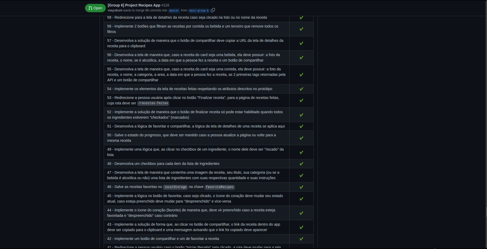

# Project Recipes App

Hello and welcome to the Recipes App project!

This was the last assignment built by [Trybe](www.betrybe.com) for the Front End Web Development Module. This challenge app was made to test the students skills with all the tools we learned with React (React Router, Redux, Context API and others). This is also where I put my leadership skills to the test as I took the Agile Methods to heart and applied their concepts in order to better organize my team and write quality code.

As per the time of this current commit, this is the project I'm most proud of!

### Evaluator Results

